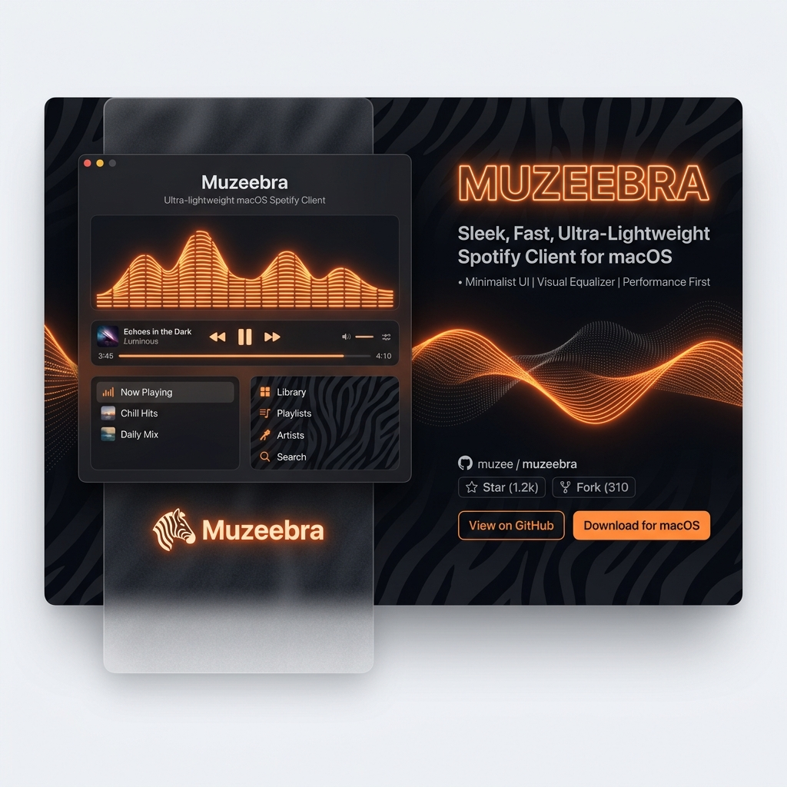

<p align="center">
  
</p>

<p align="center">
  <a href="https://developer.apple.com/swift/"></a>
  <a href="https://developer.apple.com/macos/"></a>
  <a href="https://raw.githubusercontent.com/Bunk-beds/Muzeebra-/main/LICENSE"></a>
  <a href="https://github.com/Bunk-beds/Muzeebra-/releases"></a>
</p>

---

**Muzeebra** is an ultra-lightweight, high-performance native macOS application that serves as a beautiful mini-player, visualizer, and controller for Spotify. 

By leveraging native macOS frameworks (`Swift`, `SwiftUI`, `AppKit`, `WebKit`, and `Network`), Muzeebra runs with a physical memory footprint of only **~15-30 MB of RAM** and near **0% idle CPU**—completely avoiding the heavy resource overhead and battery drain of standard Electron-based web wrappers.

---

## ⚡ Key Highlights

* **🎹 Aesthetic Winamp-style Graphic Equalizer:** Enjoy custom-rendered visual sound waves that react gracefully to your music playback, bringing back a classic desktop music feel.
* **🔌 Zero-Configuration Local Mode:** Control the official Spotify macOS desktop app directly using native AppleScript. It listens to system-wide distributed notifications (`com.spotify.client.PlaybackStateChanged`) for instantaneous state updates with zero polling overhead. Works fully offline and requires no configuration.
* **🌐 Standalone Web Mode (Built-In Web Player):** Connect to the Spotify Web API for catalog searching, playlist browsing, and queue management. It acts as an independent Spotify Connect playback receiver.
* **💤 Integrated Sleep Timer:** Set a countdown to automatically pause your music, perfect for listening to lo-fi or ambient music as you fall asleep.
* **📐 Anti-Throttling Web Engine:** Features a custom playback engine inside a borderless, transparent **1x1 background `NSWindow`**. Because the window is technically active, macOS's window server does not suspend its JavaScript or audio processes (avoiding the common "App Nap" audio stuttering seen in hidden web views).
* **🔋 Battery-Saving Low Power Mode:** Toggles background tick rates and disables visual animation cycles to preserve battery life when your MacBook is unplugged.
* **📊 Mach-Level Resource Monitor:** Collapsible footer displaying real-time physical memory usage (Resident Set Size via Mach system kernel calls), CPU percentage, and API request counters.

---

## 📦 How to Install & Run

You can run Muzeebra directly by installing the packaged disk image or building it from source.

### Option 1: Fast Install (Recommended)
1. Download the latest release: **[Muzeebra.dmg](Muzeebra.dmg)** (located in the repository root).
2. Open the `.dmg` file and drag **Muzeebra** into your **Applications** folder.
3. Launch the app from Applications or Spotlight. 
> [!NOTE]  
> *Because Muzeebra controls the Spotify application, macOS will prompt you to grant AppleScript and Automation permissions on first launch. Click **Allow** to enable playback sync.*

### Option 2: Build from Source
If you are a developer, you can compile and package the app manually. Muzeebra has **zero external package dependencies**.

**Prerequisites:**
* macOS 14.0 or later
* Xcode or Swift Command Line Tools

```bash
# Clone the repository
git clone https://github.com/Bunk-beds/Muzeebra-.git
cd Muzeebra-

# Compile, build the .app structure, codesign, and launch it
./Scripts/compile_and_run.sh
```

---

## ⚙️ Spotify API Dashboard Setup (For Web Mode)

If you wish to use the standalone **Web Mode** (which plays music directly inside Muzeebra without needing the Spotify desktop app running):

1. Go to the [Spotify Developer Dashboard](https://developer.spotify.com) and create a developer app.
2. In the app settings, add the following **Redirect URI**:
   ```
   http://127.0.0.1:5073/callback
   ```
3. Copy your app's **Client ID**.
4. In Muzeebra, open the **Settings tab**, expand **Advanced Options**, paste your Client ID, and click **Link Spotify Account** to authenticate.
5. The OAuth authorization server spins up dynamically on local port `5073` and shuts down immediately after catching the redirect code, leaving zero background ports open.

---

## 📂 Repository Structure

* [Package.swift](Package.swift) — SwiftPM Package manifest (v14 target, 0 external dependencies).
* [Sources/Muzeebra/](Sources/Muzeebra/)
  * [MuzeebraApp.swift](Sources/Muzeebra/MuzeebraApp.swift) — SwiftUI Application entry point.
  * [SpotifyStore.swift](Sources/Muzeebra/SpotifyStore.swift) — Main state coordinator and data engine.
  * [SpotifyLocalService.swift](Sources/Muzeebra/SpotifyLocalService.swift) — AppleScript executor for local desktop control.
  * [SpotifyWebService.swift](Sources/Muzeebra/SpotifyWebService.swift) — Web API and OAuth authorization server.
  * [SpotifyWebPlayerWindowController.swift](Sources/Muzeebra/SpotifyWebPlayerWindowController.swift) — Manages the background 1x1 transparent window.
  * [MenuBarView.swift](Sources/Muzeebra/MenuBarView.swift) — Glassmorphic main visual interface (Player, Search, settings, sleep timer, visualizer).
* [Scripts/](Scripts/)
  * [package_app.sh](Scripts/package_app.sh) — Packages the compiled binary into a `.app` bundle, injects Info.plist entitlements, and signs it.
  * [create_dmg.sh](Scripts/create_dmg.sh) — Packs the compiled app into a drag-and-drop installer disk image.
  * [compile_and_run.sh](Scripts/compile_and_run.sh) — Development script to clean, rebuild, package, and launch the application.

---

## 📄 License

Muzeebra is open-source software licensed under the [MIT License](LICENSE).
